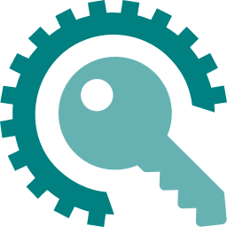

<p align="center">
  
</p>

<h1 align="center">ERP Toolkit - IITKGP</h1>

<p align="center">
  Auto-login and CV/resume deadline highlighting for IIT Kharagpur's ERP, in one lightweight, local-only browser extension.
</p>

<p align="center">
  <a href="https://github.com/SumitKumar-17/erp-toolkit/releases/latest">
    
  </a>
  
  
  <a href="./LICENSE">
    
  </a>
</p>

<p align="center">
  <a href="https://github.com/SumitKumar-17/erp-toolkit/releases/latest">⬇️ Download latest release</a>
  ·
  <a href="https://github.com/SumitKumar-17/erp-toolkit/issues/new">🐞 Report a bug</a>
  ·
  <a href="https://github.com/SumitKumar-17/erp-toolkit/issues/new">💡 Request a feature</a>
</p>

> [!NOTE]
> Not published on the Chrome Web Store (yet) — that's fine, installing it takes about a minute. Jump to **[Installation](#-installation)**.

## Table of contents

- [What it does](#what-it-does)
- [Installation](#-installation)
- [Setting it up](#setting-it-up)
- [Staying updated](#staying-updated)
- [Why this exists](#why-this-exists)
- [Permissions used](#permissions-used)
- [Security notes](#security-notes)
- [Building from source](#building-from-source-for-contributors)
- [Contributing](#contributing)

## What it does

One toolbar icon, one popup, two features:

### 🔑 Auto-login

Fills and submits the ERP SSO login form for you — username, password, and your three security-question answers. Optionally protected by a 4-digit PIN, in which case your password and answers are AES-encrypted before being saved, so nothing sensitive ever sits in plain text in browser storage.

### 🎯 Deadline Highlighter

On the CDC placement portal, color-codes every CV/resume-deadline row across four stages, so the urgent ones jump out instead of hiding in a wall of table rows:

| Stage                | Default color |
| -------------------- | ------------- |
| Upcoming (>24h left) | 🟢 Green      |
| 1 day left           | 🟡 Amber      |
| 6 hours or less      | 🟠 Orange     |
| Overdue              | 🔴 Red        |

A small floating, draggable status widget appears on the page itself, and all four colors — plus the refresh rate and auto-stop timing — are configurable from the popup.

---

## 📦 Installation

**No Node.js. No `npm install`. No build step.** Download a folder, load it, done.

| Step | Action                                                                                                                                                      |
| ---- | ----------------------------------------------------------------------------------------------------------------------------------------------------------- |
| 1    | Go to [**Releases**](https://github.com/SumitKumar-17/erp-toolkit/releases/latest) and download **`erp-toolkit-vX.Y.Z.zip`** from the release's **Assets**. |
| 2    | Unzip it — you get a folder (named after the zip) with `manifest.json` inside. That's the whole extension, nothing else needed.                             |
| 3    | Open **`chrome://extensions`** (or `edge://extensions`, `brave://extensions` — any Chromium browser works identically).                                     |
| 4    | Turn on **Developer mode** (top-right toggle).                                                                                                              |
| 5    | Click **Load unpacked** and select the unzipped folder.                                                                                                     |
| 6    | Click the toolbar icon and set up your login details — you're done.                                                                                         |

> [!WARNING]
> Every GitHub release also gets automatic **"Source code (zip)"** / **"(tar.gz)"** links — that's GitHub's doing, not a download option we provide. Those contain the entire repository (source, build configs, everything), not the built extension. Always grab **`erp-toolkit-vX.Y.Z.zip`** from **Assets** specifically.
>
> Only want to browse the source, not install the extension? That's what **Code → Download ZIP** on the repo's main page is for — see [Building from source](#building-from-source-for-contributors).

## Setting it up

1. Open the popup and enter your ERP roll number, then fetch your security questions and fill in your password + answers.
2. Optionally set a 4-digit PIN — your password and answers get encrypted (AES-GCM, key derived via PBKDF2) before saving, and the PIN is asked for on each login instead of being stored anywhere.
3. **Preferences** — theme, landing page after login, PIN-dialog style.
4. **Deadline Highlighter** — enable/disable auto-start, tweak the four status colors, set refresh/auto-stop timing. Only ever runs on the CDC placement page.

## Staying updated

> [!IMPORTANT]
> Chrome does not allow any extension loaded via **Load unpacked** to silently auto-update itself — that's a platform restriction, not a limitation of this project.

Instead, the popup checks GitHub every time you open it (and periodically in the background) and shows a banner the moment a new version ships:

1. Banner reads **"Update available: vX.Y.Z"**.
2. Click **Download update** — it downloads the new ZIP _and_ opens `chrome://extensions` for you.
3. Unzip, then click the reload icon (🔄) next to ERP Toolkit. Done.

Your installed version is always visible at the bottom of the popup (next to the copyright line), and the **About** panel shows a fuller readout — "up to date" or the version you can update to.

## Why this exists

- **Local-only, serverless.** Nothing you enter ever leaves your browser — credentials live in `chrome.storage.local`. Network requests go only to `erp.iitkgp.ac.in` (login + security questions) and GitHub's public releases API (update checks).
- **Minimal permissions**, each justified below.
- **Small.** No UI frameworks in the runtime bundle — just TypeScript and a couple of small DOM helpers.

## Permissions used

| Permission                        | Why                                                                                                                                |
| --------------------------------- | ---------------------------------------------------------------------------------------------------------------------------------- |
| `storage`                         | Saves your (optionally encrypted) credentials and preferences locally.                                                             |
| `scripting`                       | Re-injects the deadline-highlighter content script if the popup is opened before it's had a chance to load on an already-open tab. |
| `alarms`                          | Schedules the periodic "is there a newer release?" check.                                                                          |
| `downloads`                       | Lets the "Download update" button save a new release's ZIP straight to your Downloads folder.                                      |
| Host access to `erp.iitkgp.ac.in` | Required to run the login-autofill and deadline-highlighter content scripts, and to fetch your security questions.                 |

The background service worker also calls the public `api.github.com` releases endpoint to check for updates — no extra host permission is needed for that since GitHub's API allows anonymous cross-origin reads.

## Security notes

- Passwords and security-question answers are stored as-is only if you don't set a PIN. If you do, they're encrypted with AES-GCM using a key derived from your PIN via PBKDF2 (100,000 iterations) — the PIN itself is never stored anywhere.
- Nothing is sent anywhere except `erp.iitkgp.ac.in` (to log you in) and GitHub's release API (to check your version) — there's no backend of ours in the loop at all.

## Building from source (for contributors)

You don't need this to just use the extension — it's only for making changes.

```bash
git clone https://github.com/SumitKumar-17/erp-toolkit.git
cd erp-toolkit
npm install
npm run build-dev     # rebuilds extension/ on every change (npm start to watch)
npm run build-prod    # minified production build
```

Either command outputs to the same `extension/` folder — reload it from `chrome://extensions` after each build. CI automatically rebuilds `extension/`, bumps the version, and cuts a GitHub Release on every push to `main`.

## Contributing

Pull requests are welcome — please describe the change and, for anything touching the popup UI, include a screenshot. Run `npm run pretty` before committing.

## License

[MIT](./LICENSE) © Sumit Kumar

## Author

**Sumit Kumar** — [website](https://sumitk.me) · [GitHub](https://github.com/SumitKumar-17)

This project merges and rewrites two of the author's earlier extensions, [`auto-login-erp`](https://github.com/SumitKumar-17/auto-login-erp) and [`erp-cv-deadline-highlighter`](https://github.com/SumitKumar-17/erp-cv-deadline-highlighter), into one actively maintained toolkit.
